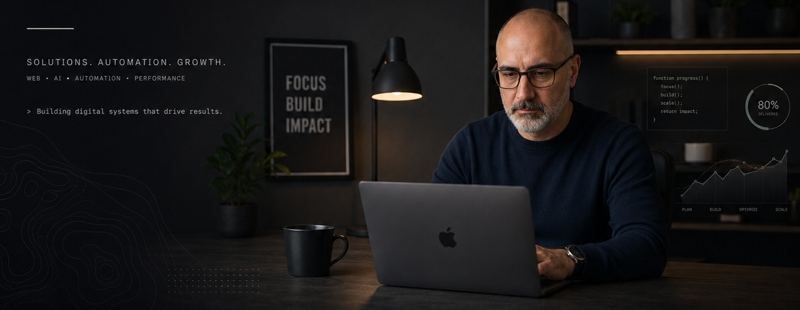
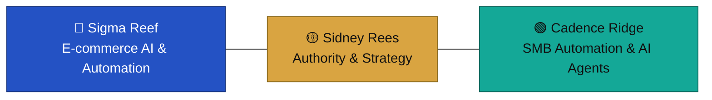

# Fractional CTO+PMO for eCommerce

**Hello, I'm Sidney Rees** 👋 — I step in when growth stalls, vendors underdeliver, or systems can't scale, and turn CTO-level strategy into PMO-level execution.

21+ years across software development, project management, and digital transformation, working globally (based in Argentina, English & Spanish).

## What I Do

- 🎯 Fractional CTO + PMO leadership for growing eCommerce businesses
- 🏗️ Technology strategy, architecture, and vendor risk management
- 📦 End-to-end product delivery and roadmap execution
- 🚑 Emergency migrations & crisis recovery
- 🤖 Automation & AI-driven operations

## Current Focus

- eCommerce Operations
- Business Automation
- AI Agents
- Product Strategy
- Technology Leadership

## Featured Work

**⚙️ Marketplace automation** — Connected Mercado Libre and WooCommerce, automated stock sync, and redesigned the fulfillment workflow, doubling sales from week one and cutting operational workload by 50%.
→ [Read the case study](https://github.com/sidneyrees/real-cases-and-success-stories#case-study-3-used-books-marketplace)

**🚨 Emergency migration & data recovery** — Recovered 40,000+ products and 8,000+ customer records from vendor lock-in in 7 days with zero downtime, using custom Python recovery bots and a new WooCommerce infrastructure.
→ [Read the case study](https://github.com/sidneyrees/real-cases-and-success-stories#case-study-1-emergency-migration--data-recovery)

More documented cases: **[real-cases-and-success-stories](https://github.com/sidneyrees/real-cases-and-success-stories)**

## The Ecosystem

Sidney doesn't just consult on AI and automation — he built the companies that prove it out:

🔵 [Sigma Reef](https://sigmareef.com) · 🟡 [Sidney Rees](https://sidneyrees.com) · 🟢 [Cadence Ridge](https://cadenceridge.com)

> Three forces. One philosophy: human-centric automation, engineered by Sidney Rees.

## Next Step

**→ [See it proven in real client engagements](https://github.com/sidneyrees/real-cases-and-success-stories)** — actual numbers, actual outcomes.

More resources

- CTO / PMO eCommerce Playbook → https://github.com/sidneyrees/pmo-ecommerce-playbook
- Tech Radar → https://github.com/sidneyrees/ecommerce-tech-radar
- Automation & AI Agents for eCommerce → https://github.com/sidneyrees/automation-agents-for-ecommerce
- Project Recovery Kit → https://github.com/sidneyrees/project-recovery-kit

## Highlights

- Platforms: Shopify, WooCommerce, Medusa.js, Saleor, AWS
- International team & vendor leadership
- 99% client satisfaction

## Let's Connect

🌐 [sidneyrees.com](https://sidneyrees.com) — book a free 30-minute eCommerce tech diagnostic

📫 Available for fractional CTO+PMO engagements
